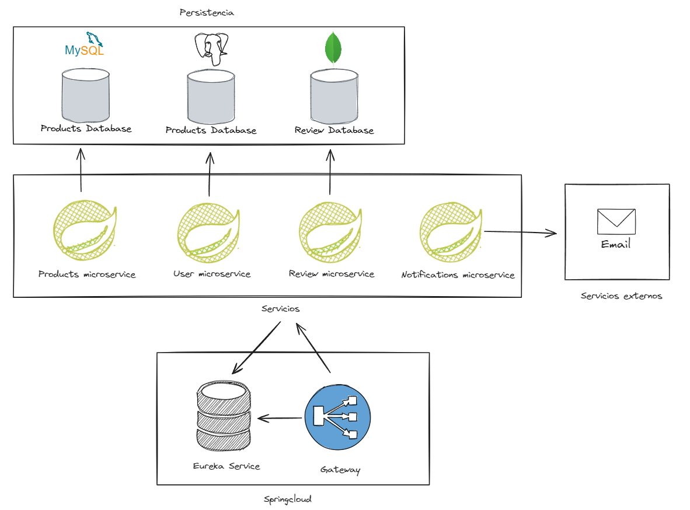

# Springcloud Microservices

## Descripción
Este proyecto es una demostración de una arquitectura de microservicios utilizando Spring Boot y Spring Cloud. 
Contiene los siguientes microservicios:

- **Eureka microservice**: Este es el servidor de descubrimiento de servicios. Todos los microservicios se 
registran en él y se descubren entre sí a través de él.
- **Gateway microservice**: Este es el punto de entrada a nuestra aplicación. Todas las solicitudes pasan a 
través de él antes de ser redirigidas a los microservicios correspondientes.
- **User microservice**: Se encarga de la gestión de usuarios, incluyendo operaciones como la creación, 
actualización, eliminación y consulta de usuarios.
- **Products microservice**: Se encarga de la gestión de productos, incluyendo operaciones como la creación, 
actualización, eliminación y consulta de productos.
- **Review microservice**: Se encarga de la gestión de reseñas de productos, permitiendo a los usuarios 
calificar y comentar sobre los productos.
- **Notifications microservice**: Se encarga de la gestión de notificaciones, permitiendo enviar mensajes a 
los usuarios sobre actualizaciones o cambios relevantes.


## Requisitos & Tecnologías
- Java Development Kit (JDK) 17
- [Spring Boot](https://spring.io/projects/spring-boot)
- [Spring Data JPA](https://spring.io/projects/spring-data-jpa)
- [Spring Mail](https://spring.io/guides/gs/sending-email/)
- [Spring Cloud](https://spring.io/projects/spring-cloud)
- [Gateway](https://spring.io/projects/spring-cloud-gateway)
- [Feign](https://spring.io/projects/spring-cloud-openfeign)
- [Eureka Server](https://cloud.spring.io/spring-cloud-netflix/multi/multi_spring-cloud-eureka-server.html)
- [MySQL](https://www.mysql.com/)
- [MongoDB](https://www.mongodb.com/)
- [PostgreSQL](https://www.postgresql.org/)
- [Gradle](https://gradle.org/)
- [Maven](https://maven.apache.org/)
- [Lombok](https://projectlombok.org/)
- [Swagger](https://swagger.io/)
- [Docker](https://www.docker.com/)
- [Docker Compose](https://docs.docker.com/compose/)


## Arquitectura

Este proyecto sigue una arquitectura de microservicios, donde cada servicio tiene su propia base de datos y 
se comunica con los demás a través de un Gateway. Aquí está una descripción detallada de cada servicio:

- **Servicio de Usuarios**: Este servicio se encarga de la gestión de usuarios y persiste los datos en una 
base de datos MySQL.
- **Servicio de Productos**: Este servicio se encarga de la gestión de productos y persiste los datos en 
una base de datos PostgreSQL.
- **Servicio de Reseñas**: Este servicio se encarga de la gestión de reseñas de productos y persiste los 
datos en una base de datos MongoDB.
- **Servicio de Notificaciones**: Este servicio se encarga de la gestión de notificaciones y utiliza un 
servicio externo para enviar correos electrónicos con Spring Mail.

Todos los servicios se descubren entre sí a través de un servidor Eureka y se consumen a través de un 
Gateway de Spring Cloud.

A continuación se muestra un diagrama de la arquitectura del sistema:



## Instalación
Pasos para instalar las dependencias y el proyecto.

```bash
# Clona este repositorio
git clone https://github.com/dev-elliotesco/springcloud-demo-mr.git

# Entra en el directorio del proyecto
cd springcloud-demo-mr

# Compila el microservicio de Eureka usando Maven
cd eureka-service
mvn clean install

# Compila el microservicio de Gateway usando Maven
cd ../gateway-service
mvn clean install

# Compila el microservicio de Usuarios usando Gradle
cd ../user-ms
./gradlew build

# Compila el microservicio de Productos usando Gradle
cd ../product-ms
./gradlew build

# Compila el microservicio de Reseñas usando Gradle
cd ../review-ms
./gradlew build

# Compila el microservicio de Notificaciones usando Gradle
cd ../notification-ms
./gradlew build
```

## Configuración

Cada microservicio tiene su propia configuración detallada en su propio archivo `README.md`. Asegúrese de 
revisar y seguir las instrucciones de configuración en cada uno de ellos antes de ejecutar el proyecto.

Además, antes de ejecutar el proyecto, asegúrese de tener una base de datos MySQL, PostgreSQL y MongoDB 
en ejecución y de configurar las variables de entorno con las credenciales correctas de la base de datos 
en cada microservicio correspondiente.

Para el servicio de notificaciones, necesitará una cuenta de correo electrónico válida y configurar 
Spring Mail con las credenciales de esa cuenta. Consulte el `README.md` del servicio de notificaciones 
para obtener instrucciones detalladas sobre cómo hacerlo.

También puede utilizar el archivo `docker-compose.yml` proporcionado en este repositorio para levantar la 
aplicación con la configuración por defecto y las bases de datos integradas.


## Ejecución
Pasos para ejecutar el proyecto.

### Localmente:

Cada microservicio puede ser ejecutado localmente de forma individual. Aquí están los comandos para cada uno:

```bash
# Iniciar el microservicio de Eureka
cd eureka-service
mvn spring-boot:run

# Iniciar el microservicio de Gateway
cd ../gateway-service
mvn spring-boot:run

# Iniciar el microservicio de Usuarios
cd ../user-ms
./gradlew bootRun

# Iniciar el microservicio de Productos
cd ../product-ms
./gradlew bootRun

# Iniciar el microservicio de Reseñas
cd ../review-ms
./gradlew bootRun

# Iniciar el microservicio de Notificaciones
cd ../notification-ms
./gradlew bootRun
```

### Docker Compose:

También puede utilizar el archivo `docker-compose.yml`para levantar todos los microservicios y las bases de 
datos con un solo comando. Esto simplifica enormemente el proceso de puesta en marcha del proyecto, ya 
que no es necesario iniciar cada microservicio y base de datos individualmente.

Para levantar todo el proyecto junto con las bases de datos, siga estos pasos:

```bash

# Entra en el directorio del proyecto completo
cd springcloud-demo-mr

# Ejecuta Docker Compose
docker-compose up
```

## Autor
- Elliot Escovicth Riaño - [Github](https://github.com/dev-elliotesco)
- [LinkedIn](https://https://www.linkedin.com/in/elliot-escovitch-580007205/)
- Correo electrónico: dev.elliot.escovitch@gmail.com